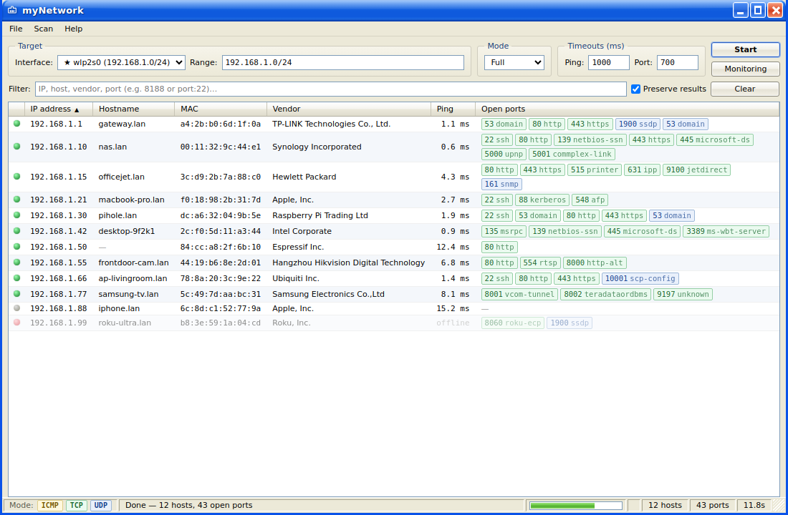

<div align="center">


# myNetwork Scanner

**Cross-platform LAN & Port Scanner with a nostalgic Windows XP (Luna) Desktop GUI.**

Discovers devices on your network, resolves hostnames & MAC vendors, detects open TCP/UDP ports, and features live monitoring with CSV/JSON export.

[](https://github.com/jarifovi)
[](https://electronjs.org)
[](https://nodejs.org)
[](#-security--design-philosophy)
[](LICENSE)

<br/>



</div>

---

## 🌟 Key Features

* **⚡ Auto-Detected Network Subnets**: Automatically lists active network interfaces and pre-fills target ranges (e.g. `192.168.1.0/24`).
* **🎯 Flexible Targeting**: Supports CIDR blocks (`10.0.0.0/24`), IP ranges (`192.168.1.1-192.168.1.50`), comma-separated lists, and single hostnames.
* **🔍 Multi-Layer Scanning Modes**:
  * **Fast Mode**: ICMP discovery + popular common ports.
  * **Full Mode**: ICMP discovery + all TCP ports (1–65535) + UDP service probes.
  * **Custom Mode**: User-defined TCP & UDP port ranges.
* **🏷️ Offline IEEE OUI Vendor Database**: Resolves device manufacturer names offline using a bundled database of ~39,700 OUI entries.
* **📡 Real-Time Network Monitoring**: Pings active devices every minute (with desktop notifications on state changes) and re-checks open ports every 5 minutes.
* **💾 Data Export & Filtering**: Instant search/filter, quick host check, and one-click export to **CSV** or **JSON**.
* **🖥️ Classic Windows XP (Luna) GUI**: Built with standard web technologies featuring custom title bar, status bar, and sortable tables.

---

## 🚀 Quick Start

### Prerequisites
* [Node.js](https://nodejs.org/) (v18 or v20+)
* `npm` (bundled with Node.js)

### Installation & Execution

1. **Clone the Repository**:
   ```bash
   git clone https://github.com/jarifovi/mynetwork-scanner.git
   cd mynetwork-scanner
   ```

2. **Install Dependencies**:
   ```bash
   npm install
   ```

3. **Start the Application**:
   ```bash
   npm start
   ```

4. **Launch with Developer Tools**:
   ```bash
   npm run dev
   ```

---

## 📦 Building Installers

You can build standalone installers for Windows, Linux, and macOS using `electron-builder`:

```bash
# Windows (.exe NSIS Installer)
npm run dist:win

# Linux (.AppImage & .deb)
npm run dist:linux

# macOS (.dmg)
npm run dist:mac
```

---

## 🏗️ Architecture & How It Works

`myNetwork Scanner` operates on a standard Electron architecture split into 3 distinct layers:

| Layer | File / Module | Function |
|-------|--------------|----------|
| **Main Process** | [`src/main.js`](src/main.js) | Window creation, IPC handling, monitoring timers, CSV/JSON export, scan caching |
| **Bridge** | [`src/preload.js`](src/preload.js) | Context bridge exposing `window.api` with strict context isolation |
| **Renderer** | [`src/renderer/`](src/renderer) | Vanilla HTML/CSS/JS frontend with Windows XP theme controls |
| **Scanner Engine** | [`src/scanner/index.js`](src/scanner/index.js) | Multi-layered scan orchestrator (`EventEmitter`) with socket throttling |
| **Discovery** | [`src/scanner/discovery.js`](src/scanner/discovery.js) | Platform ICMP ping, ARP table parser, reverse DNS lookup |
| **Port Prober** | [`src/scanner/ports.js`](src/scanner/ports.js) | Non-privileged TCP socket connect & UDP banner probing |
| **OUI Lookup** | [`src/scanner/oui.js`](src/scanner/oui.js) | Offline IEEE MAC vendor matching |

---

## 🛡️ Security & Supply-Chain Integrity

* **Zero Native Dependencies**: Uses plain Node.js standard modules (`net`, `dgram`, `child_process`).
* **No Root / Admin Required**: Performs network probes without raw sockets or admin privileges.
* **Supply-Chain Guard**: Includes an automated supply-chain audit script (`scripts/audit-supply-chain.js`) to enforce safety standards.

---

## 👤 Author & Maintainer

Maintained and published by **[jarifovi](https://github.com/jarifovi)**.

## 📄 License

This project is licensed under the [MIT License](LICENSE).

<!-- Feature badges update -->
<!-- Installer build instructions -->
<!-- Architecture & security -->
<!-- Maintainer attribution -->
<!-- Release configuration -->
<!-- Project setup complete -->
